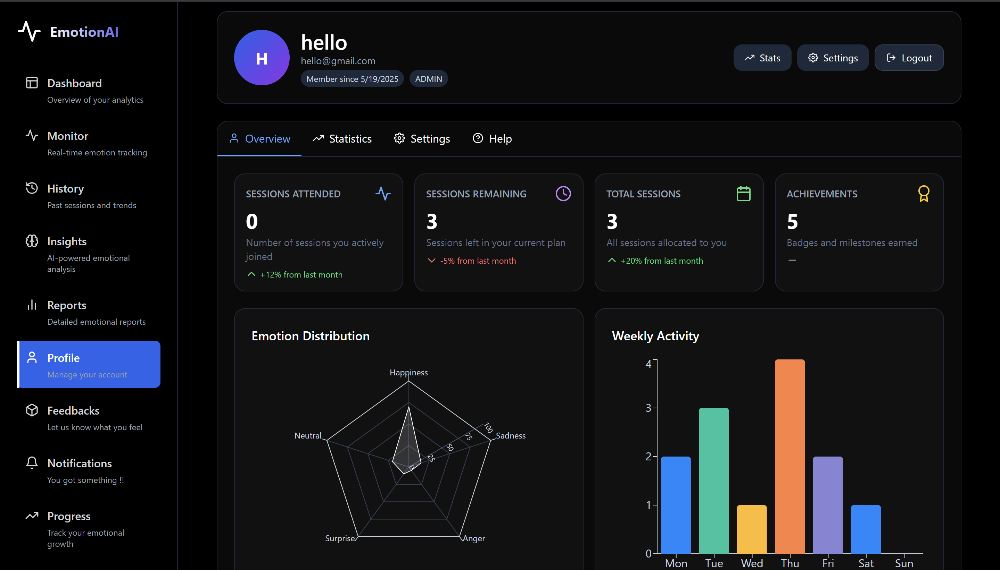
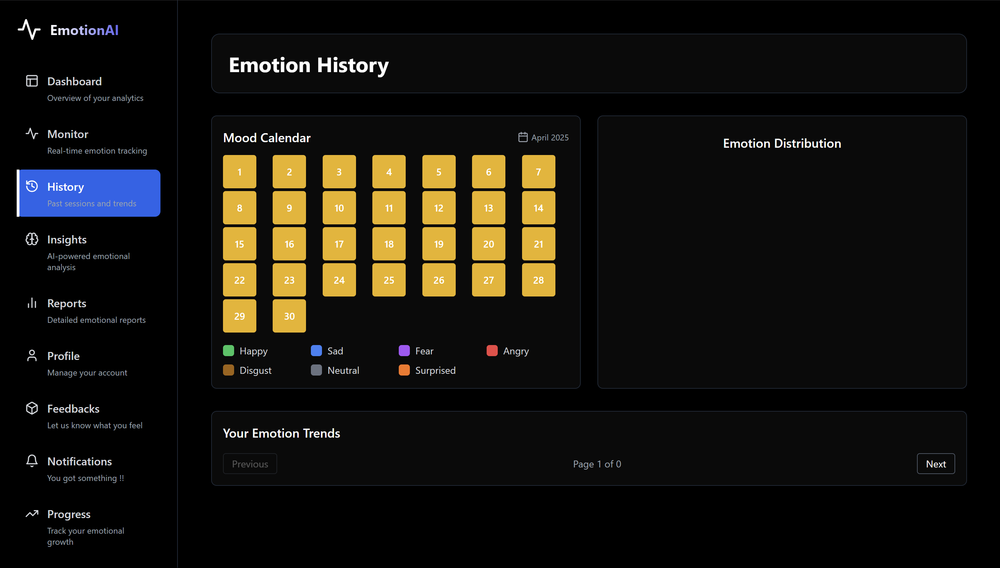
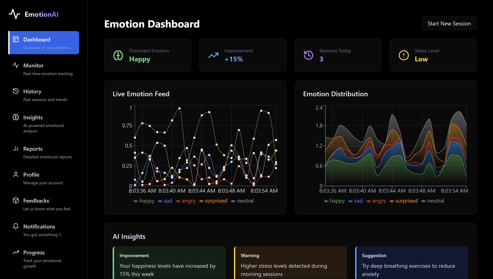
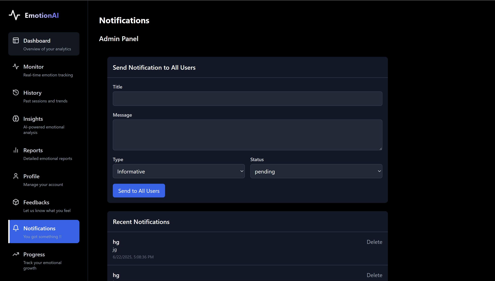

# 🎭 Emotion.AI — Intelligent Emotion Detection & Analysis System

Emotion.AI is a real-time emotion detection and analysis platform designed to understand, visualize, and track human emotions using deep learning and computer vision. It empowers users with deep emotional insights through expressive visuals, intelligent comparisons, and live monitoring.

---

## 🧠 What is Emotion.AI?

Emotion.AI is an AI-powered system that detects and analyzes human emotions from both static videos and live webcam feeds. It leverages advanced deep learning models, OpenCV, and real-time visualizations to:
- Recognize emotional states (e.g., happy, sad, angry, neutral, etc.)
- Compare emotions across sessions
- Visualize emotional patterns and trends
- Provide insights into psychological and emotional well-being

---

## 🚀 Key Features

### 🔴 Real-Time Emotion Detection
Using webcam feeds, Emotion.AI monitors and detects emotional expressions on the fly using OpenCV and a trained deep learning model.

### 🎥 Video-based Analysis
Upload a 1-minute video to receive a detailed breakdown of emotions detected over time — perfect for psychological assessments, research, and mood tracking.

### 📊 Interactive Visualizations
Generate expressive charts:
- Emotion percentage breakdowns
- Time-series emotion graphs
- Session-over-session comparison
- Progress and trend tracking

### 🧩 Intelligent Insights
The system not only detects emotions, but also offers:
- Dominant emotion analytics
- Session summaries
- Emotional improvement tracking
- Comparative insights between current and previous sessions

### 🔒 Personalized Dashboard
Every user has access to their own dashboard with:
- Session history
- Emotional progress
- Visual reports
- Live monitor view

---

  
  

  
  

## 🖼 Frontend Modules (React.js)

| Module      | Description |
|-------------|-------------|
| `Dashboard` | Overview of emotional state and trends |
| `Monitor`   | Real-time webcam-based emotion detection |
| `History`   | Logs and visualizes past sessions |
| `Insights`  | Breakdown and analysis of emotional patterns |
| `Reports`   | Downloadable visual summaries of sessions |
| `Progress`  | Track emotional changes and improvement over time |
| `Profile`   | User info, settings, and emotion profile |

---

## 🧪 Backend Intelligence

The Emotion.AI backend is designed for:
- **Emotion classification** using facial expression analysis
- **OpenCV-based webcam streaming**
- **Session data tracking** in a structured database
- **REST APIs** to fetch, analyze, and compare emotion data
- **Data storage and visualization pipeline**

---

## 🌍 Use Cases

- 🧠 **Psychological Health Monitoring**
- 🎓 **Educational Stress Analysis**
- 👥 **Human-Computer Interaction Research**
- 🏥 **Mental Wellness Tools**
- 🎮 **Emotion-aware Games**
- 📊 **User Experience Feedback**

---

## 🏗 Technologies Used

- **Frontend**: React.js, Tailwind CSS, Chart.js/Recharts
- **Backend**: Python, FastAPI/Flask
- **Emotion Detection**: TensorFlow/Keras or PyTorch
- **Real-Time Feed**: OpenCV, WebSockets
- **Data Storage**: MongoDB / PostgreSQL
- **Deployment**: Streamlit / Docker / Cloud (optional)

---

## 📈 Project Goals

- Make emotion analysis **accessible** and **understandable**
- Visualize emotion data in a **beautiful and meaningful** way
- Help individuals **track and improve** their emotional well-being over time
- Bridge the gap between **AI** and **emotional intelligence**

---

## 🧑‍💻 Built With Passion

Emotion.AI is not just a project — it’s a mission to create emotionally intelligent systems that truly understand human feelings and support emotional growth. Built by **Divyansh Garg**, this system is a step toward more empathetic, user-aware technologies.

---

## 📩 Contact

If you’d like to collaborate, improve Emotion.AI, or integrate this with your mental wellness tools, feel free to connect:

- 🔗 GitHub: [@gargdivyansh1](https://github.com/gargdivyansh1)
- 📧 Email: divyanshgarg515@gmail.com
- 💼 LinkedIn: [Divyansh Garg](https://www.linkedin.com/in/divyansh-garg515/)

---

> *“Emotion is the language of the soul — and Emotion.AI is here to help you listen.”*
